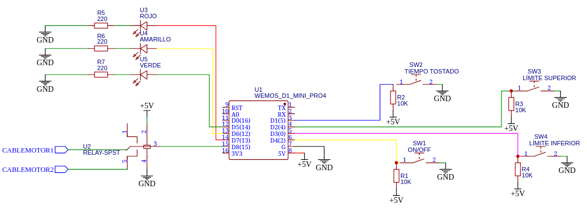

# Tostadora controlada mediante microcontrolador

Este proyecto controla una tostadora mediante una placa Wemos D1 Mini (ESP8266). 


## Características
- Plataforma: PlatformIO + ESP8266
- Lógica: C++ con debounce manual
- Documentación: Markdown
- Versionado: Git

## Pines usados

| Nombre del ćodigo   | Pin (Wemos D1) | GPIO real |
|---------------------|----------------|------------|
| BTN_ONOFF (botón de encendido)          | D4             | GPIO2      |
| BTN_SET (botón para configurar el tiempo de tostado)             | D1             | GPIO5      |
| LIMIT_INFERIOR (botón para que se pare el motor abajo)     | D3             | GPIO0      |
| LIMIT_SUPERIOR (botón para que se pare el motor arriba)     | D2             | GPIO4      |
| MOTOR_PIN (relé para manejar el motor)           | D8             | GPIO15     |
| LED_VERDE (20 segundos de tostado)          | D5             | GPIO14     |
| LED_AMARILLO (30 segundos de tostado)       | D6             | GPIO12     |
| LED_ROJO (40 segundos de tostado)           | D7             | GPIO13     |
## Código del programa

```Arduino
#include <Arduino.h>

// Definiendo los pines (si el proyecto se quiere modificar con Arduino hay que poner el número del GPIO. Por ejemplo, D4 es el GPIO 2, por lo que habría que cambiar D$ por 2)

#define BTN_ONOFF      D4 //2 en el ID Arduino
#define BTN_SET        D1
#define LIMIT_INFERIOR D3
#define LIMIT_SUPERIOR D2
#define MOTOR_PIN      D8
#define LED_VERDE      D5
#define LED_AMARILLO   D6
#define LED_ROJO       D7

// Control del rebote en el botón (Debounce)
unsigned long lastBtnTime = 0;
const unsigned long debounceDelay = 50;

// Duración del tiempo de tostado. Se pueden modificar los valores (están en milisegundos)
const unsigned long TIME_SHORT = 20000; //20 segundos
const unsigned long TIME_MEDIUM = 30000;// 30 segundos
const unsigned long TIME_LONG = 40000; // 40 segundos
unsigned long toastingTime = TIME_MEDIUM;  // Valor por defecto

// Estado de programa
enum Estado {ESPERA, BAJANDO, TOSTANDO, SUBIENDO, FINALIZADO};
Estado estado = ESPERA;

// Última opción de duración (0 = 20s, 1 = 30s, 2 = 40s)
int tiempoIndex = 1;

void apagarTodo() {
  digitalWrite(MOTOR_PIN, LOW);
  digitalWrite(LED_VERDE, LOW);
  digitalWrite(LED_AMARILLO, LOW);
  digitalWrite(LED_ROJO, LOW);
}


void mostrarLED() {
  digitalWrite(LED_VERDE, tiempoIndex == 0 ? HIGH : LOW);
  digitalWrite(LED_AMARILLO, tiempoIndex == 1 ? HIGH : LOW);
  digitalWrite(LED_ROJO, tiempoIndex == 2 ? HIGH : LOW);
}


void setup() {
  Serial.begin(115200);

  // Configuración de pines
  pinMode(BTN_ONOFF, INPUT);
  pinMode(BTN_SET, INPUT);
  pinMode(LIMIT_INFERIOR, INPUT);
  pinMode(LIMIT_SUPERIOR, INPUT);
  pinMode(MOTOR_PIN, OUTPUT);
  pinMode(LED_VERDE, OUTPUT);
  pinMode(LED_AMARILLO, OUTPUT);
  pinMode(LED_ROJO, OUTPUT);

  apagarTodo();
}

void loop() {
  unsigned long tiempoActual = millis();

  // Botón SET para elegir tiempo de tostado
  if (digitalRead(BTN_SET) == LOW && (tiempoActual - lastBtnTime > debounceDelay)) {
    tiempoIndex = (tiempoIndex + 1) % 3;  // ciclo entre 0, 1, 2
    lastBtnTime = tiempoActual;

    switch (tiempoIndex) {
      case 0: toastingTime = TIME_SHORT; break;
      case 1: toastingTime = TIME_MEDIUM; break;
      case 2: toastingTime = TIME_LONG; break;
    }

    mostrarLED();
    Serial.print("Tiempo de tostado seleccionado: ");
    Serial.println(toastingTime / 1000);
  }

  switch (estado) {
    case ESPERA:
      if (digitalRead(BTN_ONOFF) == LOW) {
        estado = BAJANDO;
        Serial.println("Iniciando bajada...");
        digitalWrite(MOTOR_PIN, HIGH);
        delay(200);  // estabilizar motor
      }
      break;

    case BAJANDO:
      if (digitalRead(LIMIT_INFERIOR) == LOW) {
        digitalWrite(MOTOR_PIN, LOW);
        estado = TOSTANDO;
        Serial.println("Bandeja abajo. Iniciando tostado...");
        delay(200);  // estabilizar relé
        lastBtnTime = tiempoActual;
      }
      break;

    case TOSTANDO:
      if ((tiempoActual - lastBtnTime) >= toastingTime) {
        estado = SUBIENDO;
        Serial.println("Tostado completo. Subiendo bandeja...");
        digitalWrite(MOTOR_PIN, HIGH);
        delay(200);
      }
      break;

    case SUBIENDO:
      if (digitalRead(LIMIT_SUPERIOR) == LOW) {
        digitalWrite(MOTOR_PIN, LOW);
        estado = FINALIZADO;
        Serial.println("Proceso terminado. Bandeja arriba.");
      }
      break;

    case FINALIZADO:
      if (digitalRead(BTN_ONOFF) == LOW) {
        estado = BAJANDO;
        Serial.println("Reiniciando proceso...");
        digitalWrite(MOTOR_PIN, HIGH);
        delay(200);
      }
      break;
  }
}

```
## Montaje

### Led

Su configuración es sencilla, unicamente es necesario una resistencia de 220 ohmios y tener en cuenta cuál es el ánodo (donde conectas el positivo) y el cátodo (conectas el negativo).


## Explicación teórica mediante la ley de Ohm

**I = V / R**

Donde:

- **I** = corriente en amperios (A)  
- **V** = voltaje aplicado (V)  
- **R** = resistencia en ohmios (Ω)

---

### Desarrollo del cálculo

- Tensión de salida del pin digital del Wemos D1:  
  **V = 3.3 V**

- Caída de tensión típica del LED (rojo):  
  **V_LED = 2.0 V**

- Resistencia:  
  **R = 220 Ω**

- Voltaje sobre la resistencia:  
  **V_R = V - V_LED = 3.3 V - 2.0 V = 1.3 V**

**I = 1.3 V / 220 Ω ≈ 0.0059 A = 5.9 mA**

Con esto sabemos que una resistencia de **220Ω** limita la corriente del LED a aproximadamente **5.9 mA**. El pin del microcontrolador no podría entrengar más de 12 mA de forma segura.

---
### Botones

Los botones están en una configuración pull up. 


### Montaje final


